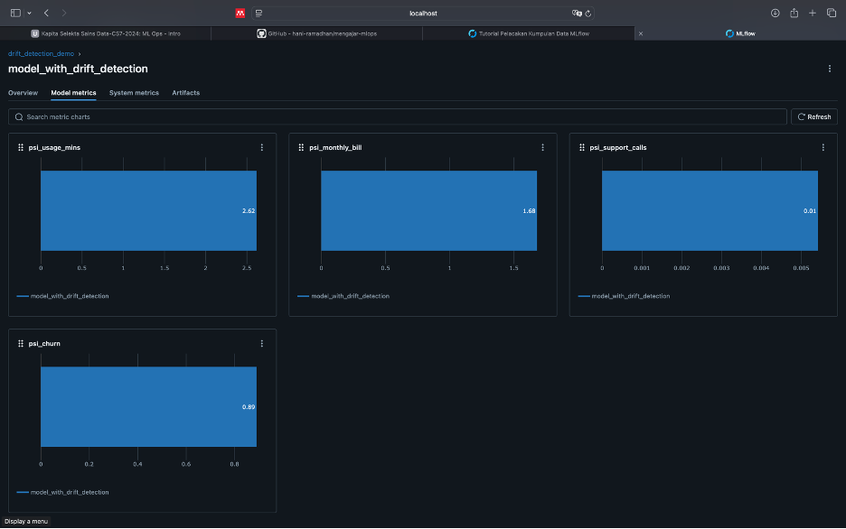

# Laporan_MLOPS
Laporan Kapita Selekta Sains Data

# MLOps Project Report

**Full Name :** Mohammad Rizky Arfiyanto 

**NIM :** 105220033

---

## Environment Setup
- Screenshot of successful MLflow UI startup
  
  
- List of installed packages (requirements.txt)
  
  

## Task 1: Synthetic Data Results
- Screenshot of Model Comparisons

  

  
  
- Brief analysis of which model performed better and why

  Berdasarkan visualisasi perbandingan dua model dari satu eksperimen pada MLflow, model RandomForest terlihat lebih unggul dibandingkan LogisticRegression jika dilihat dari metrik auc_score dan accuracy. Nilai auc_score dari RandomForest lebih tinggi, menunjukkan performa yang lebih baik dalam membedakan kelas positif dan negatif. Selain itu, accuracy yang lebih tinggi juga mengindikasikan bahwa model RandomForest lebih andal dalam membuat prediksi yang benar secara keseluruhan. Performa yang lebih baik ini kemungkinan dipengaruhi oleh kemampuan RandomForest dalam menangani data yang kompleks dengan melakukan ensemble decision trees.
  
- Any interesting patterns in the metrics

  

  

---

## Task 2: Dataset Documentation
- Description of your chosen dataset
  Dataset yang saya gunakan yaitu winequality-white.csv adalah kumpulan data yang berisi informasi tentang kualitas wine putih berdasarkan berbagai karakteristik kimia. Dataset ini mencakup fitur seperti tingkat keasaman, kadar gula, pH, kandungan alkohol, dan lainnya, yang digunakan untuk memprediksi skor kualitas wine. Skor kualitas biasanya diberikan dalam skala numerik, menggambarkan seberapa baik wine tersebut berdasarkan evaluasi sensorik. Dataset ini sering digunakan dalam pembelajaran mesin untuk klasifikasi atau regresi guna menentukan hubungan antara sifat kimia dan kualitas wine.
  
- Screenshots of dataset logging in MLflow
  
  

  

  
  
- Any challenges faced during dataset logging
  
  Code yang harus di sesuaikan.

---

## Task 3: Custom Dataset Results
- Screenshots of model comparisons
  
  

  
  
  - Model Name : MLP Classifier
    
    Run Name : trusting-shrimp-161
  

  - Model Name : Random Forest
    
   Run Name : delicate-wolf-398
  
  
  - Modell Name : Logistic Regression
    
    Run Name : salty-worm-160
  
  

- Analysis of model performance
  performa model dapat dilihat melalui nilai akurasi yang dicapai. Model "trusting-shrimp-161" memiliki akurasi sebesar 0.50, menunjukkan performa yang cukup rendah dalam menyelesaikan tugasnya. Model "salty-worm-160" sedikit lebih baik dengan akurasi 0.59, namun masih berada di bawah tingkat akurasi yang optimal. Model dengan performa terbaik adalah "delicate-wolf-398", dengan akurasi sebesar 0.71, yang lebih menjanjikan dibandingkan dua model lainnya. Dengan demikian, model "delicate-wolf-398" saat ini merupakan kandidat terbaik di antara ketiga model yang dievaluasi, tetapi mungkin masih memerlukan penyempurnaan untuk mencapai akurasi yang lebih tinggi.
  
- Comparison with synthetic data results

---

## Task 4: Drift Detection

---

## Reflection

Menurut saya dengan MLflow, kita bisa melacak eksperimen, menyimpan model, membandingkan metrik performa, dan menyimpan artefak model. Salah satu fitur utamanya yaitu kemampuan untuk memvisualisasikan metrik seperti akurasi, sehingga memudahkan kita untuk mengevaluasi dan memilih model terbaik. Selain itu, MLflow juga mendukung registrasi model untuk mempermudah proses deployment ke lingkungan produksi.

saya menambahkan fungsi dalam train_model.py sebagai berikut.

def check_mlflow_server():
    try:
        response = requests.get("http://localhost:5001")
        if response.status_code == 200:
            print("MLflow server is running.")
        else:
            print("MLflow server is not running.")
            exit(1)
    except ConnectionError:
        print("Failed to connect to MLflow server.")
        exit(1)

lalu, saya juga merubah port menjadi 5001. Sebelumnya juga saya mengalami masalah kecil pada saat saya install requirements.txt, karena saya menggunakan environment yang sudah ada pada device saya yaitu python 3.11.5 dan pada saat saya install requirements.txt mengalami konflik versi antara beberapa dependensi jadi perlu disesuaikan.

---

## Your GitHub Repo

https://github.com/Kikyarfi/Laporan_MLOPS
